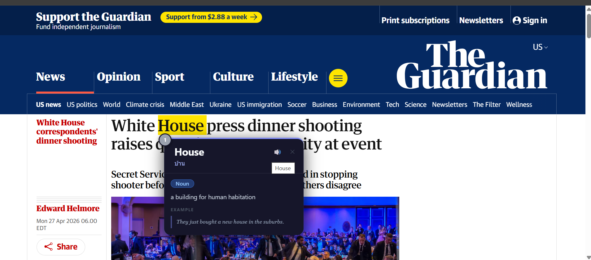
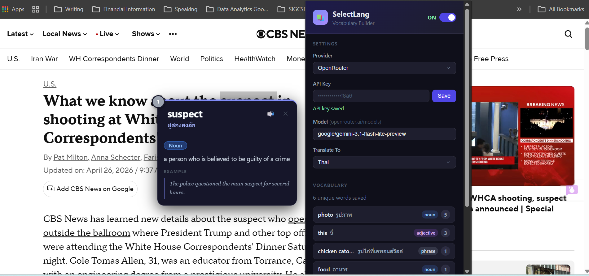

# SelectLang

> Highlight any word to instantly translate, analyze, and build your vocabulary — powered by your choice of AI provider.

---

## Screenshots

| Translation Popup | Settings & Vocabulary |
|:---:|:---:|
|  |  |
| Highlight a word on any webpage to get an instant translation, part-of-speech tag, definition, and example sentence | Manage your API key, provider, target language, and review saved vocabulary — all from the extension popup |

---

## What it does

SelectLang is a Chrome extension that turns any webpage into a language learning environment. Select any word or phrase and a popup appears with:

- **Translation** into your chosen language
- **Part of speech** (noun, verb, adjective, adverb, idiom, phrase) — color-coded
- **Definition** in plain English
- **Example sentence**
- **Pronunciation** via text-to-speech
- **Frequency badge** — tracks how many times you've looked up a word (gray → yellow → orange → red as it grows)

Every valid lookup is automatically saved to your personal vocabulary list, which you can review, manage, and export as CSV.

---

## Supported AI Providers

| Provider | Default Model |
|---|---|
| OpenRouter *(recommended)* | `anthropic/claude-haiku-4-5` |
| Anthropic (Claude) | `claude-haiku-4-5` |
| OpenAI | `gpt-4o-mini` |
| Google Gemini | `gemini-2.0-flash` |

You can override the model name with any model string your provider supports.

---

## Supported Languages

English · Thai · Spanish · French · Japanese · Korean · Chinese (Simplified) · German · Italian · Portuguese · Arabic

---

## Installation

> The extension is not on the Chrome Web Store. Install it as an unpacked extension.

1. Download or clone this repository.
2. Open Chrome and go to `chrome://extensions/`.
3. Enable **Developer mode** (top-right toggle).
4. Click **Load unpacked** and select the project folder.
5. The SelectLang icon will appear in your toolbar.

---

## Setup

1. Click the SelectLang icon in your toolbar.
2. Choose your **Provider** from the dropdown.
3. Paste your **API key** and click **Save**.
4. Optionally enter a custom **Model** name.
5. Choose your **Translate To** language.
6. Start highlighting text on any webpage.

### Getting an API key

| Provider | Where to get a key |
|---|---|
| OpenRouter | [openrouter.ai/keys](https://openrouter.ai/keys) |
| Anthropic | [console.anthropic.com](https://console.anthropic.com) |
| OpenAI | [platform.openai.com/api-keys](https://platform.openai.com/api-keys) |
| Google Gemini | [aistudio.google.com/app/apikey](https://aistudio.google.com/app/apikey) |

---

## Features

### Instant Popup
Highlight any word or phrase on any webpage. The popup appears at your cursor with translation and full analysis loaded in real time. Press `Esc` or click anywhere outside to dismiss it.

### Frequency Badge
A small badge on each popup shows how many times you have looked up that word. The color escalates from gray → yellow → orange → red as the count grows, helping you spot your weakest vocabulary.

### Vocabulary Manager
Open the extension popup to see all your saved words sorted by lookup frequency. Each entry shows the original word, its translation, part of speech, and count. Hover over any word to reveal a delete button.

### CSV Export
Export your entire vocabulary list as a UTF-8 CSV file. Fields included:

```
timestamp, original, translation, part_of_speech, definition, example, target_language, count, page_url
```

### Enable / Disable Toggle
Turn the extension on or off from the popup header without changing any settings.

---

## File Structure

```
SelectLang/
├── manifest.json     # Extension manifest (Manifest V3)
├── background.js     # Service worker — AI API calls & Chrome storage
├── content.js        # Injected script — popup UI & selection handling
├── popup.html        # Extension popup — settings & vocabulary manager
├── popup.js          # Popup logic
├── styles.css        # Shared styles
└── icon.png          # Extension icon
```

---

## Privacy

- Your API key is stored locally in `chrome.storage.local` and never sent anywhere except directly to the AI provider you configured.
- All vocabulary data is stored locally in your browser. Nothing is synced to any external server.
- The extension only activates on text you explicitly select.

---

## License

MIT
